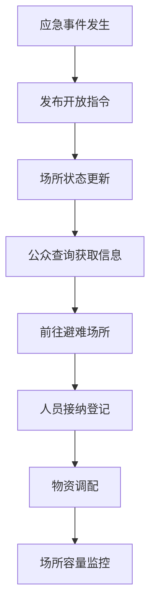
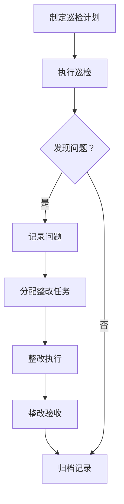

## 1. 产品概述

城市应急避难场所管理 Web 平台是一套面向应急管理部门、街道办和场所管理员的综合管理系统，用于统一管理城市应急避难场所信息、物资、人员调度和演练等资源，提升应急响应效率，保障公众安全。

- 核心目标：实现避难场所数字化管理、物资智能化调度、应急响应快速化、公众服务便捷化
- 目标用户：应急管理部门工作人员、街道办管理人员、避难场所管理员、社会公众
- 市场价值：提升城市应急管理水平，保障人民生命财产安全，构建智慧城市应急体系

## 2. 核心功能

### 2.1 用户角色

| 角色 | 注册方式 | 核心权限 |
|------|----------|----------|
| 应急管理部门 | 系统分配账号 | 全局数据查看、统计分析、指令发布、场所审批、报表导出 |
| 街道办 | 系统分配账号 | 辖区内场所管理、物资调度、巡检安排、演练组织 |
| 场所管理员 | 系统分配账号 | 场所信息维护、物资登记、巡检记录、人员接纳登记 |
| 社会公众 | 无需注册 | 场所查询、路线指引、满意度反馈 |

### 2.2 功能模块

1. **场所台账**：场所基础信息管理、地图展示、设施状态标注、无障碍条件登记、照片上传
2. **容量评估**：可容纳人数测算、容量预警、负荷分析
3. **物资清单**：物资入库出库、库存管理、到期提醒、负责人通讯录
4. **开放调度**：临时开放指令发布、场所状态切换、人员接纳登记
5. **巡检维护**：巡检计划制定、问题记录、整改跟踪
6. **公众查询**：场所搜索、地图定位、路线指引、满意度反馈
7. **演练记录**：演练计划、签到记录、效果评估
8. **报表中心**：分级统计、数据导入、多维度分析报表

### 2.3 页面详情

| 页面名称 | 模块名称 | 功能描述 |
|----------|----------|----------|
| 场所台账 | 场所列表 | 场所基础信息展示、筛选、搜索、分页 |
| 场所台账 | 地图视图 | 场所位置标注、详情弹窗、分类显示 |
| 场所台账 | 详情编辑 | 新增/编辑场所信息、设施标注、无障碍登记、照片上传 |
| 容量评估 | 容量测算 | 根据面积和类型自动测算可容纳人数 |
| 容量评估 | 负荷分析 | 当前容量使用情况、预警提示 |
| 物资清单 | 物资列表 | 物资分类展示、库存数量、有效期提醒 |
| 物资清单 | 出入库管理 | 物资入库、出库、调拨 |
| 开放调度 | 指令发布 | 发布临时开放/关闭指令 |
| 开放调度 | 人员登记 | 避难人员登记、统计 |
| 巡检维护 | 巡检计划 | 制定巡检计划、分配任务 |
| 巡检维护 | 问题整改 | 记录问题、跟踪整改、验收 |
| 公众查询 | 场所搜索 | 按区域、类型搜索场所 |
| 公众查询 | 路线指引 | 导航路线规划、展示 |
| 演练记录 | 演练列表 | 演练计划、签到、评估 |
| 报表中心 | 统计报表 | 多维度统计、图表展示、数据导出 |

## 3. 核心流程

### 3.1 应急响应流程

### 3.2 巡检整改流程

## 4. 用户界面设计

### 4.1 设计风格

- **主色调**：深蓝色 (#1e40af) 代表专业、安全、可信赖
- **辅助色**：橙色 (#f97316) 用于警示、提醒、行动按钮
- **成功色**：绿色 (#10b981) 表示正常、通过
- **警告色**：红色 (#ef4444) 表示危险、异常
- **中性色**：深灰 (#1f2937)、中灰 (#6b7280)、浅灰 (#f3f4f6)
- **按钮风格**：圆角矩形，悬停有阴影和颜色加深
- **字体**：使用思源黑体 / Noto Sans SC，清晰易读
- **布局风格**：卡片式布局，顶部导航 + 左侧菜单
- **图标风格**：线性图标，简洁统一

### 4.2 页面设计概览

| 页面名称 | 模块名称 | UI 元素 |
|----------|----------|----------|
| 场所台账 | 列表视图 | 数据表格、筛选栏、操作按钮、分页 |
| 场所台账 | 地图视图 | 地图容器、标记点、信息弹窗 |
| 容量评估 | 测算面板 | 表单输入、计算结果展示、图表 |
| 物资清单 | 列表 | 卡片布局、状态标签、到期提醒徽章 |
| 开放调度 | 指令面板 | 时间线、状态切换、表单弹窗 |
| 巡检维护 | 任务列表 | 任务卡片、进度条、状态流转 |
| 公众查询 | 搜索页面 | 搜索框、地图、列表切换 |
| 报表中心 | 统计面板 | 多种图表、筛选条件、导出按钮 |

### 4.3 响应式设计

- 桌面端（1280px 及以上：三栏布局，完整功能
- 平板（768px - 1279px：两栏布局，菜单可折叠
- 移动端（768px 以下：单栏布局，底部导航

### 4.4 交互设计

- 页面加载动画：骨架屏
- 数据更新：平滑过渡
- 按钮悬停：阴影加深 + 轻微放大
- 表单验证：实时反馈
- 通知提示：右上角 Toast 消息
