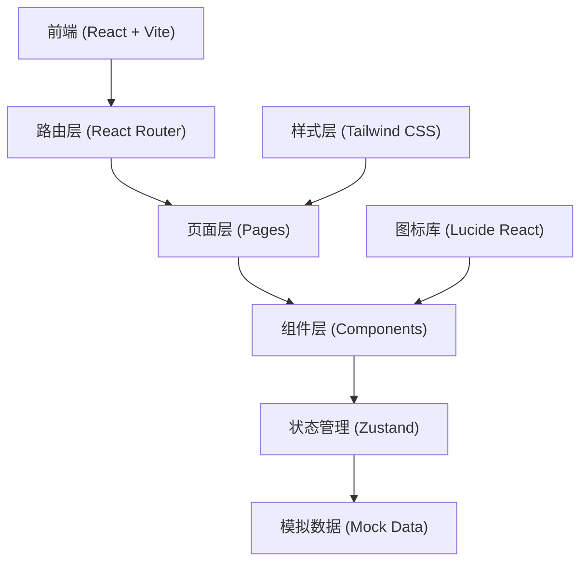
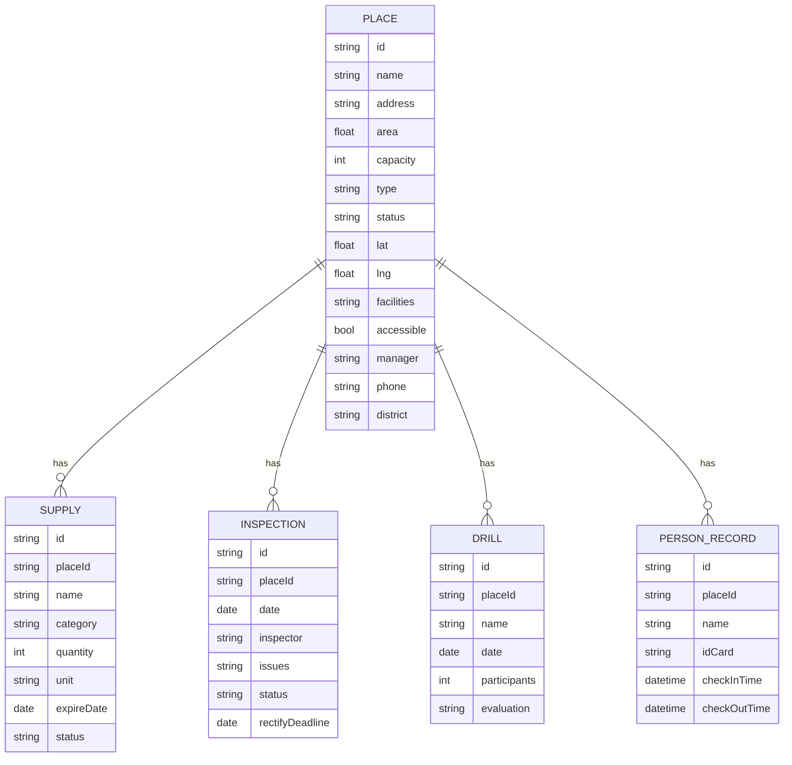

## 1. 架构设计



## 2. 技术说明

- **前端框架**: React 18 + TypeScript
- **构建工具**: Vite 5
- **样式方案**: Tailwind CSS 3
- **路由管理**: React Router DOM 6
- **状态管理**: Zustand
- **图标库**: Lucide React
- **图表库**: Recharts
- **后端**: 纯前端项目，使用 Mock 数据
- **数据存储**: LocalStorage 用于持久化

## 3. 路由定义

| 路由路径 | 页面名称 | 说明 |
|----------|----------|------|
| / | 首页/数据概览 | 系统首页，展示关键数据指标 |
| /places | 场所台账 | 避难场所列表和地图展示 |
| /places/:id | 场所详情 | 单个场所详细信息 |
| /capacity | 容量评估 | 容量测算和负荷分析 |
| /supplies | 物资清单 | 物资管理和到期提醒 |
| /dispatch | 开放调度 | 开放指令和人员登记 |
| /inspection | 巡检维护 | 巡检计划和问题整改 |
| /public | 公众查询 | 面向公众的场所查询页面 |
| /drills | 演练记录 | 演练管理和签到 |
| /reports | 报表中心 | 统计分析和数据导出 |

## 4. 数据模型

### 4.1 数据模型定义



### 4.2 类型定义

```typescript
// 场所类型
interface Place {
  id: string;
  name: string;
  address: string;
  area: number;
  capacity: number;
  type: 'indoor' | 'outdoor' | 'comprehensive';
  status: 'normal' | 'open' | 'closed' | 'maintenance';
  lat: number;
  lng: number;
  facilities: string[];
  accessible: boolean;
  manager: string;
  phone: string;
  district: string;
  photos?: string[];
  description?: string;
  currentPeople?: number;
}

// 物资类型
interface Supply {
  id: string;
  placeId: string;
  name: string;
  category: string;
  quantity: number;
  unit: string;
  expireDate: string;
  status: 'normal' | 'expiring' | 'expired';
}

// 巡检记录
interface Inspection {
  id: string;
  placeId: string;
  date: string;
  inspector: string;
  issues: string[];
  status: 'pending' | 'rectifying' | 'completed';
  rectifyDeadline?: string;
  rectifyResult?: string;
}

// 演练记录
interface Drill {
  id: string;
  placeId: string;
  name: string;
  date: string;
  participants: number;
  evaluation: string;
  signInList: string[];
}

// 人员登记
interface PersonRecord {
  id: string;
  placeId: string;
  name: string;
  idCard?: string;
  checkInTime: string;
  checkOutTime?: string;
}

// 开放指令
interface DispatchOrder {
  id: string;
  placeId: string;
  type: 'open' | 'close';
  reason: string;
  createTime: string;
  operator: string;
  status: 'active' | 'expired';
}
```

## 5. 项目结构

```
src/
├── components/          # 公共组件
│   ├── Layout/         # 布局组件
│   ├── common/         # 通用组件（按钮、卡片、表格等）
│   └── charts/         # 图表组件
├── pages/              # 页面组件
│   ├── Dashboard/      # 数据概览
│   ├── Places/         # 场所台账
│   ├── Capacity/       # 容量评估
│   ├── Supplies/       # 物资清单
│   ├── Dispatch/       # 开放调度
│   ├── Inspection/     # 巡检维护
│   ├── Public/         # 公众查询
│   ├── Drills/         # 演练记录
│   └── Reports/        # 报表中心
├── store/              # 状态管理
├── data/               # Mock 数据
├── types/              # TypeScript 类型定义
├── utils/              # 工具函数
├── App.tsx
├── main.tsx
└── index.css
```
